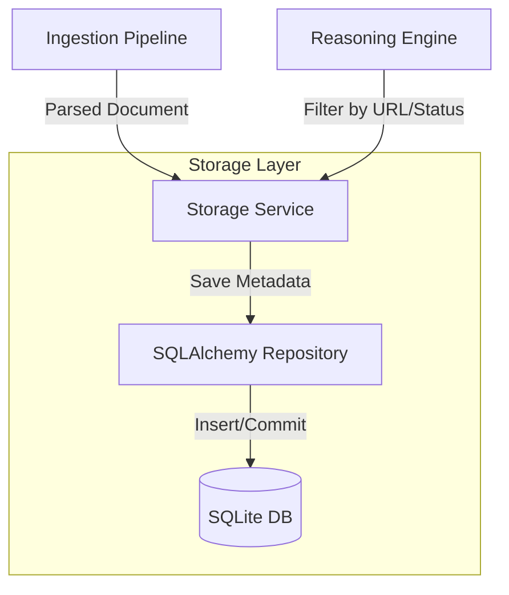
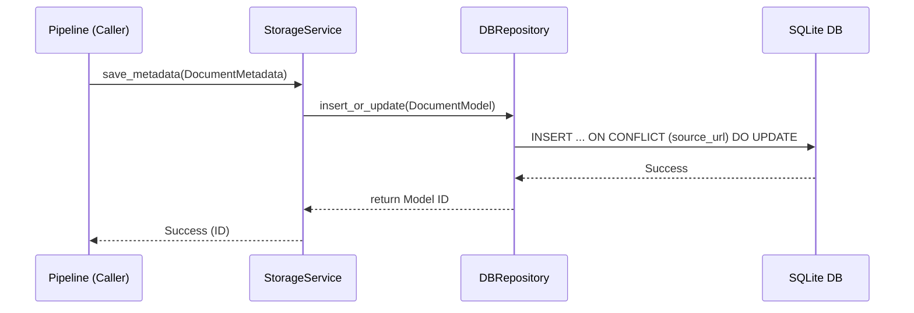

# Technical Design: 004-aim-store-document-metadata - Store Document Metadata

**Status:** Draft
**Reference Spec:** `specs/apps/aim/004-aim-store-document-metadata/spec.md`
**Author:** Architect Agent

## 1. High-Level Approach
The Ingestion System scrapes articles, but we need a fast and structured way to track what has been scraped to avoid duplication and provide simple metadata filtering for the reasoning engine. 
Based on the Aim V1 Architecture, we will implement this using SQLite via SQLAlchemy for the persistent store. This gives us relational capabilities with zero setup requirements, meeting the V1 constraints while allowing easy migration to PostgreSQL in V2.

## 2. Component Architecture

### Diagram (System Context)

## 3. Data Models & Schema

We will use SQLAlchemy and Pydantic. 
- **Pydantic Model (`DocumentMetadata`):** For transferring data within the application.
- **SQLAlchemy ORM Model (`DocumentModel`):** For database representation.

**Document Schema:**
* `id`: Integer (Primary Key, Auto-increment)
* `source_url`: String (Unique, Indexed)
* `title`: String (Nullable)
* `author`: String (Nullable)
* `published_date`: DateTime (Nullable)
* `ingested_at`: DateTime (Default Now)
* `processing_status`: String (Enum: PENDING, PROCESSED, ERROR)
* `error_message`: String (Nullable)

## 4. Detailed Logic & Algorithms

### Sequence Diagram (Happy Path - Insert)

## 5. Interface Specifications

* **Public Methods in `StorageService` (`apps/aim/storage/service.py`):**
  * `save_metadata(doc: DocumentMetadata) -> int`: Persists the metadata and returns the new ID.
  * `get_metadata_by_url(url: str) -> DocumentMetadata | None`: Fetches a precise document.
  * `get_pending_documents(limit: int = 100) -> list[DocumentMetadata]`: Fetches documents needing vector processing.

## 6. Implementation Plan (Task List)

* [ ] Task 1: Setup SQLAlchemy database connection manager and declarative base in `apps/aim/storage/database.py`. The DB path should be configurable (e.g., via environment variable with a default local path).
* [ ] Task 2: Create SQLAlchemy ORM models (`DocumentModel`) in `apps/aim/storage/models.py`.
* [ ] Task 3: Create Pydantic schemas (`DocumentMetadata`) in `apps/aim/storage/schemas.py`.
* [ ] Task 4: Implement CRUD repository logic in `apps/aim/storage/repository.py` specifically handling unique constraints on `source_url` (UPSERT logic).
* [ ] Task 5: Implement `StorageService` in `apps/aim/storage/service.py` wrapping the repository.
* [ ] Task 6: Write unit tests using an in-memory SQLite database (`sqlite:///:memory:`).

## 7. Verification Strategy

* **Unit Tests:** 
  * Test `save_metadata` on a new URL ensures an insertion occurs.
  * Test `save_metadata` on an existing URL ensures an update occurs (no duplication).
  * Test `get_metadata_by_url` retrieves the correct properties.
  * *Constraint Check*: Verify performance by inserting 1000 records in <1s in memory.
* **Component Test:** 
  * Initialize the actual file-based SQLite database and verify tables are created automatically on startup.
